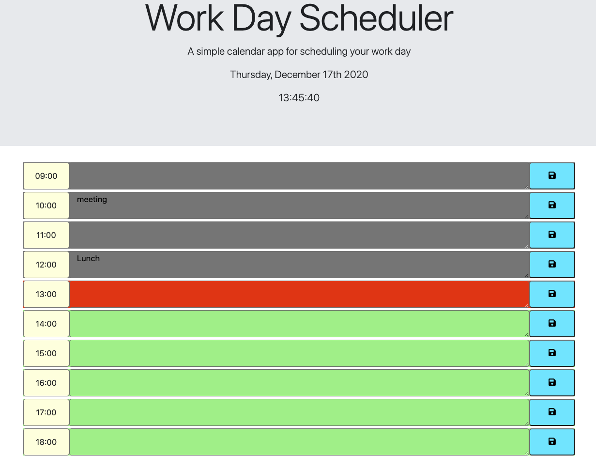
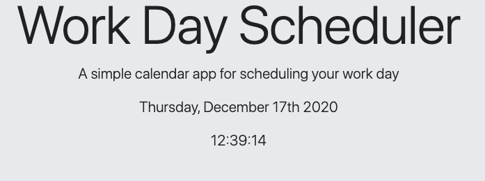
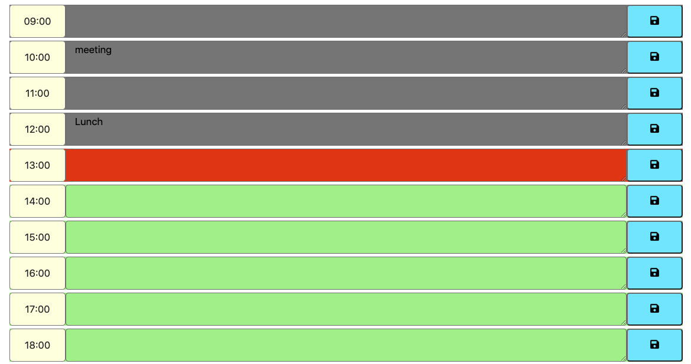

# Work Day Scheduler
This program is a day-to-day calendar that enables the user to save appointments on the the text box and shows the current date at the header.

## Installation
The calendar is color coded based on the past, present and future. Gray for the past hour, Red for the current time and Green for the future hours. I used .CSS to style the page.

.JS file was used for the functonlaity of the calendar such as dislaying the current date and time, saving the user input in the text area with the local storage and creating a function for the past, present and future feature.

I also used [Moment.js](https://momentjs.com/) to show the current date and time and [Font Awesome](https://fontawesome.com/icons/save?style=solid) for the floopy disc icon instead of 'save' word.

## Usage
[Work_Day_Schedule](https://criscel.github.io/Work-Day-Scheduler/)

## Credits
[Code Validator](https://validator.w3.org/nu/),
[MDN Javascript](https://developer.mozilla.org/en-US/docs/Web/JavaScript),
[W3Scools](https://www.w3schools.com/js/default.asp),
[Moment.js](https://momentjs.com/)
[Font Awesome](https://fontawesome.com/icons/save?style=solid)

### Jekyll Themes

This Page uses the layout and styles from the Jekyll that I have selected [Thanks Github! :)]